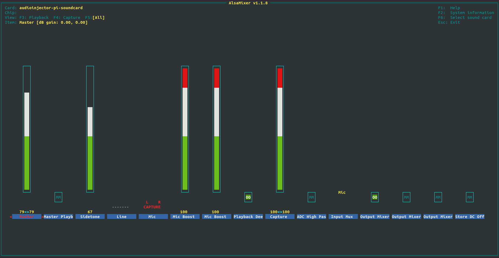

# Конфиги для RPI

1. .config - конфиг ядра для сборки (положить в корневую папку ядра)
2. config.txt - конфиг файл RPI (положить в раздел /boot)
3. dt-blob.bin - конфиг GPU (для конфигурации камеры) (положить в /boot)
4. dt-blob-cam1.dts - вышеупомянутый конфиг в формате dts (на случай необходимости внести изменения)
5. asound.conf - конфиг аудио кодека (положить в /rootfs/etc)

# Настройка аудио кодека

1. sudo alsamixer
2. в открывшейся утилите нажать F6 и выбрать audioinjector-pi-soundcard
3. Нажать F5
4. установить параметры как показано ниже (для изменения параметров используются клавиши вверх/вниз, M, O, space)

5. нажать Esc
6. sudo alsactrl

